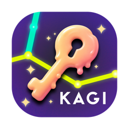
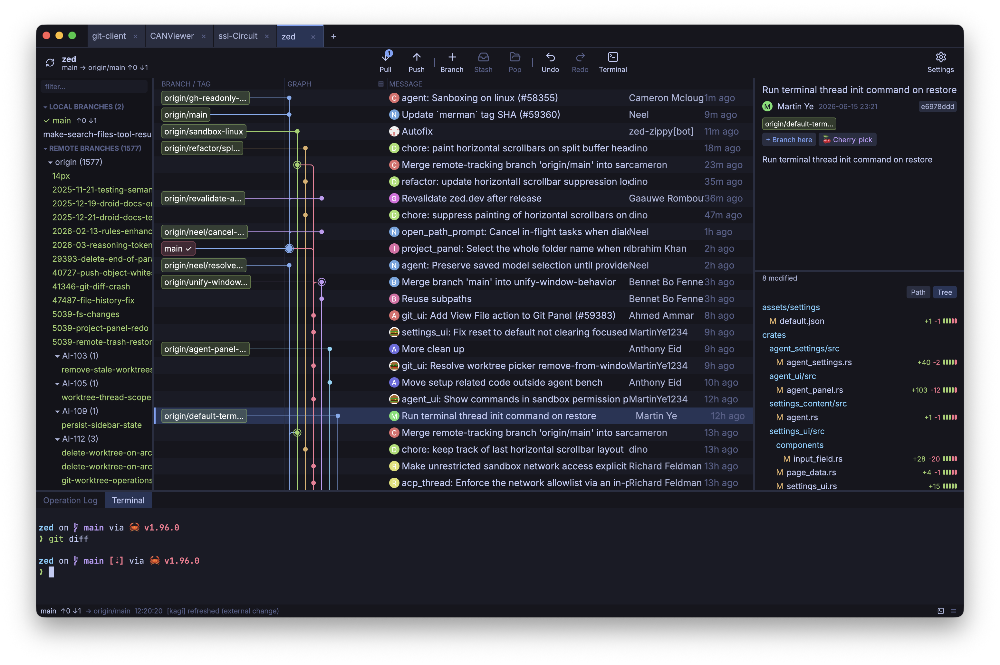
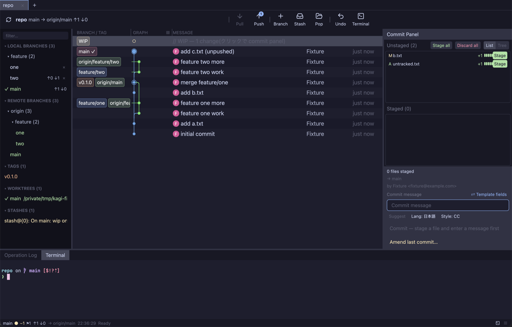

<div align="center">



# Kagi 🔑

**コミットグラフ中心の、安全第一な Git GUI クライアント**

Rust + [GPUI](https://www.gpui.rs/)([Zed](https://zed.dev/) の UI フレームワーク)製


[](https://github.com/TomiXRM/kagi/releases)
[](LICENSE)



[English README is here](./README.md)

</div>

---

Kagi は **すべての Git 操作の実行前に「何が起きるか」を見せ**、そもそもリポジトリを壊す操作が存在しないように設計された Git クライアントです。すべての書き込みは `plan → 確認 → preflight → execute → verify` のパイプラインを通ります。

## ✨ 機能

- 🌳 **コミットグラフが主役** — GitKraken 風レーン、ref バッジ、HEAD リング、merge ノード、WIP 行。1万 commit 超でも軽い仮想化リスト
- 🔍 **リッチなインスペクタ** — GitHub アバター、co-author 表示、変更ファイルツリー、シンタックスハイライト付き diff
- 📊 **Per-file diffstat** — 各ファイル行に `+N −M` と緑/赤のミニバー
- ✅ **コミットスイート** — pre-commit チェックリスト(conflict marker / secret / 巨大バイナリ)、branch ごとの draft 自動保存、構造化メッセージテンプレート、SHA 変化を見せる amend
- 🤖 **Smart commit message** — rule-based 生成は常時利用可。**ローカル Ollama LLM は明示 opt-in**(staged diff のみ・localhost のみ・初回同意ダイアログ)
- 🧪 **危険操作は dry-run してから** — cherry-pick / revert / checkout の conflict は libgit2 の **in-memory merge** で予測。working tree には触れません
- 🗑️ **Backup-then-discard** — unstaged 変更の破棄は、先にファイル内容を ODB に blob として保存して操作ログに記録してから。いつでも復元できます
- 🪄 **全部非同期** — checkout / commit / stash / pull / push / cherry-pick … すべて UI スレッド外で実行。ウィンドウは固まりません
- 🖥️ **内蔵ターミナル** — 選択・⌘C/⌘V・テーマ連動カラー
- 🎨 **6 テーマ** — Catppuccin、Xcode dark/light、One dark/light、Monokai vivid
- 🗂️ **リポジトリタブ**、prefix ツリー化された branch サイドバー(remote もグループ化)、操作ログ、ネイティブメニューバー

<div align="center">

</div>

## 🔒 安全設計(このアプリの核)

| 保証 | 仕組み |
|------|--------|
| 実行前に結果が見える | すべての操作に plan モーダル: 現在 → 実行後の状態、警告、blocker、失敗時の復旧手順。blocker があると実行ボタン自体が出ません |
| 破壊的コマンドが存在しない | `git push --force` / `reset --hard` / `git clean` は**コードベースに実装されていません** |
| conflict は「予測」する | in-memory merge による dry-run。conflict が予測されたら working tree 無傷のまま中止 |
| 何も黙って失わない | checkout 前の auto-stash、discard 前の ODB blob バックアップ、before/after 付きの追記専用操作ログ(`~/.kagi/operations.jsonl`)|
| ref 移動は最後 | working tree を先に書き、ref は最後に動かす。途中失敗でも HEAD は元のまま |

## 📦 インストール

[**GitHub Releases**](https://github.com/TomiXRM/kagi/releases) からダウンロードしてください。各リリースに `SHA256SUMS-*.txt` を同梱しています。

| OS | アセット |
|----|----------|
| macOS(Apple Silicon)| `Kagi-<version>-arm64.dmg` |
| Linux(x86_64 / arm64)| `kagi-<version>-<arch>.tar.gz`(バイナリ + `.desktop` + アイコン)、または AppImage zip `kagi_Linux-AppImage_<arch>.zip` |

AppImage の場合: `unzip kagi_Linux-AppImage_<arch>.zip && bash scripts/install_linux_desktop.sh` で `~/.local` 配下に登録(アイコン + `.desktop`、ネットワーク不要)。

### ⚠️ macOS: 未署名ビルドの初回起動について

Kagi はまだ Apple による notarization を行っていません(ad-hoc 署名のみ。Apple Developer ID 未取得のため)。初回起動時に Gatekeeper が「開発元を確認できません」と警告するので、どちらかで回避してください:

1. **`Kagi.app` を右クリック → 開く → 開く**(初回のみ。以降は普通に起動できます)
2. もしくは quarantine 属性を外す:

   ```sh
   xattr -dr com.apple.quarantine /Applications/Kagi.app
   ```

Apple Developer Program 取得後に署名 + notarization(ADR-0038 Phase 2)へ移行予定です。

## 🛠️ ソースからビルド

必要なもの: Rust stable(rustup)、macOS は **Xcode Command Line Tools のみ**(full Xcode 不要。GPUI の `runtime_shaders` を使用)。

```sh
git clone https://github.com/TomiXRM/kagi.git
cd kagi
cargo run --release -- /path/to/your/repo
```

- 初回ビルドは gpui / libgit2 のコンパイルで数分(以降は数秒)
- bare repository は開けません(working tree のある通常 repo を指定)

### 手元の repo を触らずに試す

```sh
REPO=$(bash scripts/make_fixture.sh)   # 検証用 repo を生成
cargo run -- "$REPO"
```

fixture には分岐・merge・remote(ahead/behind)・tag・stash・dirty working tree が一通り入っています。

### 自分でパッケージする

`xtask` が macOS 標準ツールだけで配布物を作ります(Homebrew / cargo-bundle 不要):

```sh
bash scripts/make_icon.sh                 # 角丸アイコン → assets/icon/(icns + PNG)
cargo run -p xtask -- bundle-macos        # target/dist/Kagi.app(ad-hoc 署名済)
cargo run -p xtask -- dmg-macos           # target/dist/Kagi-<version>-<arch>.dmg
cargo run -p xtask -- bundle-linux        # target/dist/kagi-<version>-<arch>.tar.gz
cargo run -p xtask -- bundle-appimage --bin target/release/kagi  # AppImage zip(Linux では appimagetool が必要)
```

タグ `v*` を push すると [release workflow](.github/workflows/release.yml) が macOS arm64 + Linux x86_64 / arm64 をビルド(tar.gz + AppImage zip)し、checksum 付きで draft release に上げます。

## 🧑‍💻 開発

```sh
cargo test --workspace    # 28+ integration suites + unit tests
```

- 設計ドキュメント: [docs/requirements.md](docs/requirements.md) · [docs/architecture.md](docs/architecture.md) · [ADR](docs/adr/)
- チケット: [docs/tickets/INDEX.md](docs/tickets/INDEX.md)
- **実 repo でのテスト禁止** — `scripts/make_fixture.sh` / tempdir を使うこと。`KAGI_AUTO_CONFIRM` などの `KAGI_*` 環境変数はヘッドレステスト専用です

## 🗺️ ステータス

活発に開発中。実装済み: コミットグラフ UX 一式、branch / tag / stash / worktree 管理、ステージング + コミットスイート、dry-run 安全機構付きの cherry-pick / revert / amend / discard、リポジトリタブ、テーマ、内蔵ターミナル、GitHub アバター、配布パイプライン。ロードマップは [docs/requirements.md](docs/requirements.md) とチケット INDEX を参照。

## 📄 ライセンス

[MIT](LICENSE) です。vendored の `vendor/gpui-terminal` は upstream が MIT OR Apache-2.0 で、本プロジェクトでは MIT 側で利用しています。
