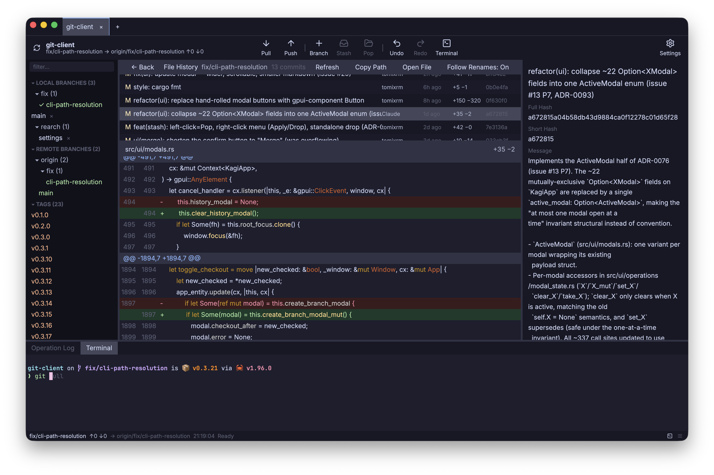
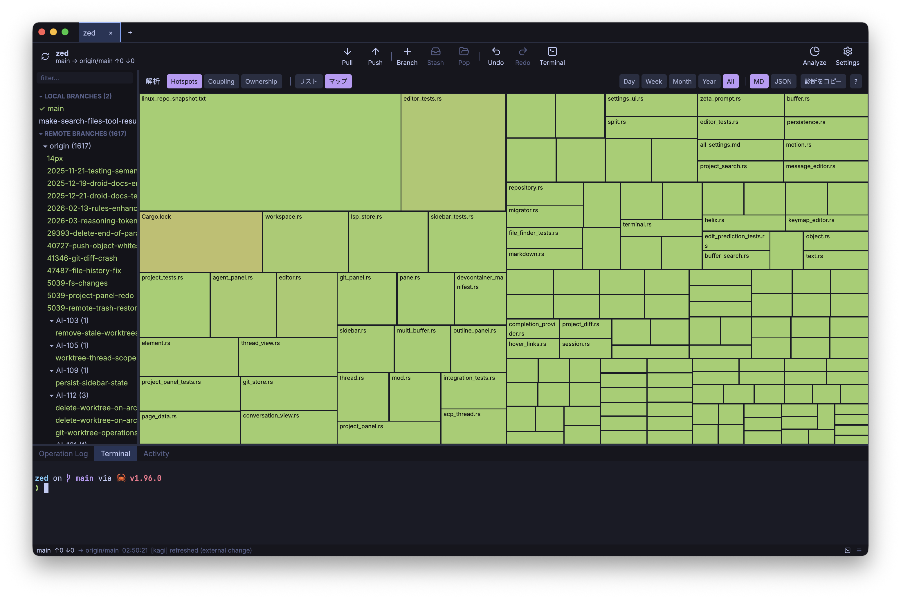
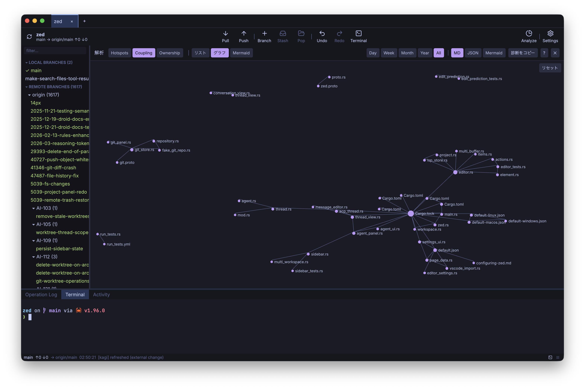
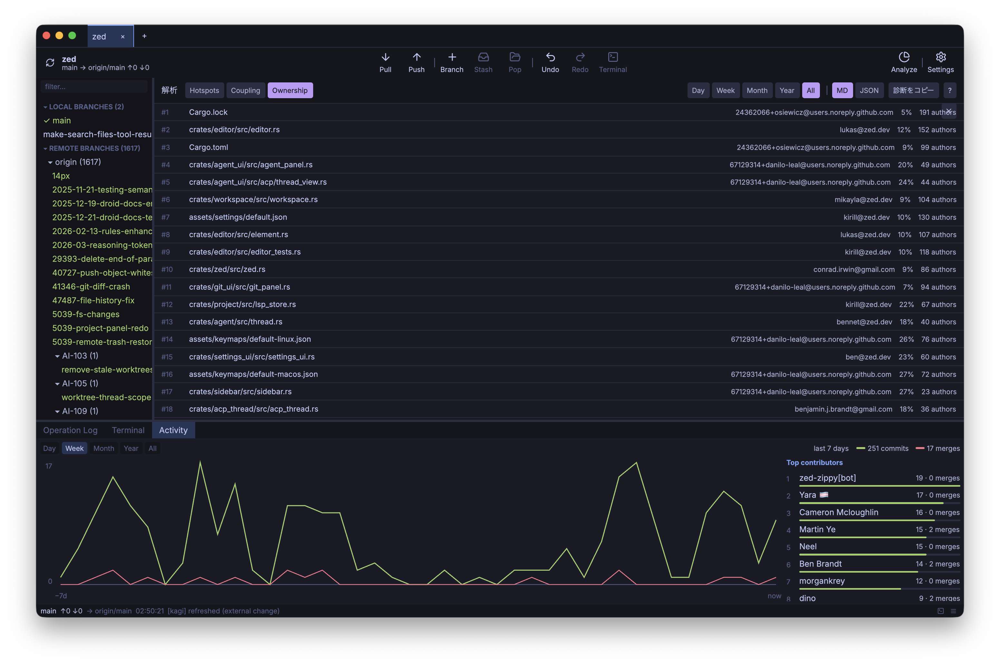

<div align="center">


# Kagi 🔑

### 何が起きるかを先に見せる、リポジトリを壊せない Git GUI。

[](https://github.com/TomiXRM/kagi/releases)
[](https://github.com/TomiXRM/kagi/stargazers)
[](https://github.com/TomiXRM/kagi/releases)
[](LICENSE)


Rust + [GPUI](https://www.gpui.rs/)([Zed](https://zed.dev/) の UI フレームワーク)製。

**[⬇ ダウンロード(macOS · Linux · Windows)](https://github.com/TomiXRM/kagi/releases/latest)** &nbsp;·&nbsp; [English README](./README.md)


</div>

---

Kagi はひとつの方針で作ったデスクトップ Git クライアントです。
**Git コマンドで不意打ちを食らわせない。**
何かを書き込む前に、現在の状態、実行後に予測される状態、警告や blocker、取り消す方法を示します。
そのうえで `plan → confirm → preflight → execute → verify` のパイプラインを通して操作を実行します。

作業を失わせるコマンド(`push --force` や `reset --hard`、`git clean`)を確認ダイアログで止めているわけではありません。
**そもそもコードベースのどこにもありません。**

> **開発状況**：活発に開発中で、macOS では日常的に使っています。
> Linux は対応済みです。
> **Windows は実験的**で、CI でビルドするのみ、メンテナによる検証はまだ済んでいません。
> macOS ビルドは ad-hoc 署名のみで notarize は未対応です(初回起動の手順は[インストール](#-インストール)を参照してください)。

## 安全性が中心にある設計

<div align="center">

</div>

書き込み操作はすべて、まず **plan** を開きます。
plan には、現在から予測へと変わる状態、警告、blocker、そして平易な言葉で書いた復旧手順が並びます。
blocker があるあいだは、押せる実行ボタンが存在しません。
これは後付けの「本当に実行しますか?」ダイアログではなく、操作を実行する唯一の経路です。

| Kagi が約束すること | どう担保しているか |
|---|---|
| **結果を先に見せる** | すべての操作で plan(現在から予測へ変わる状態、警告、blocker、復旧手順)を提示する。blocker があれば実行ボタンは描画すらしない。 |
| **破壊的コマンドが存在しない** | `push --force` や `reset --hard`、`git clean` は**どこにも実装していない**。規律ではなく CI の grep ゲートで担保する。 |
| **conflict は遭遇するものではなく予測するもの** | cherry-pick、revert、merge、checkout の conflict を `libgit2` の in-memory dry-run で検出する。予測の時点では working tree に一切触れない。 |
| **conflict 解決はやり直せる** | Conflict Mode はいつでも操作前の状態へ abort できる。解決の途中経過は自動保存する。 |
| **黙って失われない** | checkout 前の自動 stash、discard 前の object DB への blob バックアップ、before/after を記録する追記専用の操作ログ(`~/.kagi/operations.jsonl`)を備える。 |
| **ref の移動は最後** | working tree を先に書き、ref は最後に動かす。操作の途中で失敗しても HEAD は元の位置のまま。 |

## conflict を 1 行ずつ解決する

<div align="center">

</div>

merge や rebase、cherry-pick、revert で conflict が起きると、Kagi は **Conflict Mode** に切り替わります。
Conflict Mode は、**Current**、その場で編集できる **Result**、**Incoming** の 3 ペインエディタです。
採用するかどうかを file や chunk、**行単位**で切り替えられるほか、conflict ダッシュボードと Save → stage → Continue のフローを備えます。

上のスクリーンショットでは、片方の branch が LED をボード内蔵ピンへ変え、もう片方が点滅を速くしました。
そのため **LED のピン**と **`delay()` の間隔**の両方が conflict しています。
同じファイルの中で **ピンは一方の branch から、間隔はもう一方から**採れて、クリックするたびに Result が更新されます。
abort すれば、始める前の状態にそのまま戻ります。

## コミットグラフの読みやすさ

<div align="center">

</div>

色分けされたレーンが各 branch の履歴をたどり、ref バッジと HEAD リングが現在地を示します。
merge ノードはインラインで描かれ、先頭には常に WIP 行が並びます。
**stash もグラフの中に描画され**、それぞれが作成元の commit へ線で繋がります。
ラベルとノードを結ぶコネクタが、すべての branch と tag をその commit に対応づけます。
仮想化しているので、1 万 commit を超えるリポジトリでも動きは滑らかです(スクリーンショットはいずれも実際の履歴で、上は Zed、こちらは小さな fixture)。

## commit を詳しく見る

<div align="center">

</div>

commit を選ぶとインスペクタが開きます。
author と co-author、メッセージ全文に加えて、ファイルごとに `+N −M` の diffstat バーが付いた変更ファイルツリーが並びます。
diff は `+`/`−` の hunk をシンタックスハイライトと行番号付きで表示します。
ファイルを選べば、その diff へ直接ジャンプします。

## ファイルの履歴をたどる

<div align="center">

</div>

任意のファイルで **File History** を開くと、そのファイルを変更したすべての commit をたどれます。左にファイル単位の commit 一覧、右に選択中エントリのそのファイルの diff が出ます。矢印キーでエントリを移動でき、**rename を追跡**してファイルの過去まで遡り、パスのコピーやファイルを開く操作、終わったらグラフへ戻る、ができます。

## 変更が集中する場所を見つける

<div align="center">

</div>

**Analyze**(Settings の隣にある読み取り専用のツールバービュー)は、Git 履歴の全体を掘り起こして、リポジトリの「コードのエコシステム」を可視化します。
書き込み操作も新しい Git コマンドも一切増やさず、結果は判定ではなく**注目すべき箇所**として示します。
3 つのモードが、ひとつの**期間セレクタ**(Day / Week / Month / Year / All)を共有します。

- **Hotspots**:*churn × サイズ*(変更頻度を、ファイルの大きさで重み付けしたもの)でファイルをリスク順に並べます。変更が集中する一握りのファイル、つまりバグが溜まりやすい場所が見えます。ランク付きリストでも、**treemap ヒートマップ**(タイルの大きさ = LOC、色 = リスク)でも表示できます。
- **Coupling**:一緒に変更されるファイル(論理的・時間的な結合)を、ペアのリストか、ズーム・パンできる**力学的レイアウトのグラフ**で表示します。Mermaid へエクスポートしたり、mermaid.live で開いたりできます。
- **Ownership**:ファイルごとの主要 author、その占有率、author の数を示し、単独 owner やバス係数 1 のファイルに印を付けます。

<div align="center">


</div>

設定可能な ignore リスト(gitignore 形式、Settings で編集)でバイナリや生成物を分析から外せます。
**Copy diagnostic** は現在のビューを(Markdown / JSON、Coupling では Mermaid も)クリップボードへ書き出します。そのまま AI チャットに貼れる、LLM 向けのコンテキストです。
履歴のスキャン結果はキャッシュされるので、ビューを開き直してもすぐに表示されます。

## 日常作業のためのその他の機能

- **commit まわり一式**：`+N −M` の diffstat バーが付いた staging、コミット前チェックリスト(conflict marker や secret、巨大バイナリ)、branch ごとの下書き自動保存、`type(scope): summary` のメッセージテンプレート、SHA の変化を見せる amend。
- **Activity ビュー**：commit と merge のチャート、貢献者ランキングを Day / Week / Month / Year / All の期間で表示。バケットごとのツールチップと、ホバーで即時に更新される読み取り値付き。
- **commit メッセージの補助**：ルールベースの生成は常に使えます。**ローカルの Ollama LLM は明示的な opt-in のみ**で、対象は staged diff だけ、localhost のみ、利用には事前同意が必要です。
- **すべて非同期**：checkout や commit、stash、pull、push、merge はどれも UI スレッドの外で実行され、処理中は回転するスナックバーが出ます。ウィンドウが固まることはありません。
- **自分好みに調整できる**：11 種類のカラーテーマ、英語と日本語の UI(Git のドメイン語はどちらでも英語のまま)、内蔵ターミナル、リポジトリのタブ、branch のプレフィックスでまとめるツリーサイドバー、操作ログ、UI 全体を一括で変えるズーム。

## 📦 インストール

最新ビルドは [**GitHub Releases**](https://github.com/TomiXRM/kagi/releases) から入手できます。
各リリースには `SHA256SUMS-*.txt` が付属するので、ダウンロードしたファイルを検証してください。
v0.3.4 以降は、アプリ内から更新の確認とインストールもできます。

| OS | アセット |
|----|---------|
| macOS (Apple Silicon) | `Kagi-<version>-arm64.dmg` |
| Linux (x86_64 / arm64) | `kagi-<version>-<arch>.tar.gz`(バイナリ + `.desktop` + アイコン)、または AppImage の zip `kagi_Linux-AppImage_<arch>.zip` |
| Windows (x86_64) | `kagi-<version>-x86_64-windows.zip`(展開して `kagi.exe` を実行。単体で動作) |

<details>
<summary><b>macOS（未署名ビルドの初回起動）</b></summary>

Kagi はまだ **Apple の notarize に対応していない**(ad-hoc 署名のみで Apple Developer ID も未取得)ため、Gatekeeper が「開発元を確認できない」と警告します。
次のいずれかで起動してください。

1. **`Kagi.app` を右クリック → 開く → 開く**(初回だけ。以降は通常どおり起動できます)。
2. quarantine 属性を外す。
   ```sh
   xattr -dr com.apple.quarantine /Applications/Kagi.app
   ```

署名と notarize は、Apple Developer Program への加入後に対応する予定です。
</details>

<details>
<summary><b>Linux（AppImage）</b></summary>

```sh
unzip kagi_Linux-AppImage_<arch>.zip && bash install_linux_desktop.sh
```
これで `~/.local` 配下に登録されます(アイコンと `.desktop` エントリ、完全オフライン)。
</details>

<details>
<summary><b>Windows（初回起動と現状）</b></summary>

Windows ビルドは**実験的かつベストエフォート**です(CI でのビルドとパッケージングまでで、メンテナによる実機検証はまだ済んでいません。不具合の報告は歓迎します)。
未署名のため、初回起動時に SmartScreen が警告します。
**詳細情報 → 実行**を選んでください。
`PATH` に通常の `git` を通しておくことをおすすめします(Kagi は `git` を呼び出し、内蔵ターミナルを開きます)。
</details>

## 🛠️ ソースからビルド

<details>
<summary><b>必要なものと手順</b></summary>

Rust stable(rustup)に加えて、次が必要です。

- **macOS**：**Xcode Command Line Tools だけ**(フルの Xcode は不要。Kagi は GPUI の `runtime_shaders` を使います)。
- **Linux**：GPUI のネイティブビルド依存。Debian/Ubuntu では次のとおりです。
  ```sh
  sudo apt-get install -y \
    libxkbcommon-dev libxkbcommon-x11-dev libwayland-dev \
    libx11-dev libxcb1-dev libfontconfig-dev libfreetype-dev \
    libasound2-dev libvulkan-dev libzstd-dev
  ```

```sh
git clone https://github.com/TomiXRM/kagi.git
cd kagi
cargo run --release -- /path/to/your/repo
```

初回ビルドは gpui と libgit2 のために数分かかりますが、それ以降は数秒で済みます。
bare リポジトリには対応していません(working tree のある通常のリポジトリを指定してください)。

**`kagi` コマンドを `PATH` に通す:**
```sh
cargo install --path .          # ~/.cargo/bin に `kagi` をインストール
kagi /path/to/your/repo         # そのリポジトリで Kagi を開く
kagi                            # 引数なし → Welcome 画面
```
バイナリはアセットをすべて埋め込んでいるので、単体で動作します。

**自分のリポジトリに触れずに試す:**
```sh
REPO=$(bash scripts/make_fixture.sh)   # branch・merge・remote・tag・stash・dirty な working tree を用意
cargo run -- "$REPO"
```
</details>

## 🧑‍💻 開発

<details>
<summary><b>テスト、ドキュメント、v1.0 に向けた再設計</b></summary>

```sh
cargo test --workspace
```

- 設計ドキュメント：[docs/requirements.md](docs/requirements.md) · [docs/architecture.md](docs/architecture.md) · [ADR](docs/adr/)
- **実リポジトリに対してテストしないでください。** `scripts/make_fixture.sh` か tempdir を使ってください。`KAGI_*` 環境変数は headless テスト用のものです。
- Kagi は現在、安全第一の設計を規約ではなく型システムで担保できるよう、レイヤ分けした Cargo workspace へと再設計を進めています。詳しくは [docs/rearch/](docs/rearch/) と [ADR 0072 以降](docs/adr/)を参照してください。守るべき中核の不変条件は、UI が `git2` に直接触れず、すべての Git 操作が `plan → confirm → preflight → execute → verify → log` パイプラインを通ることです(これも CI の grep ゲートで担保しています)。
</details>

## 📄 ライセンス

[MIT](LICENSE) です。
同梱のターミナルコンポーネント(`vendor/gpui-terminal`)は上流で MIT OR Apache-2.0 のデュアルライセンスであり、本プロジェクトでは MIT として利用しています。
