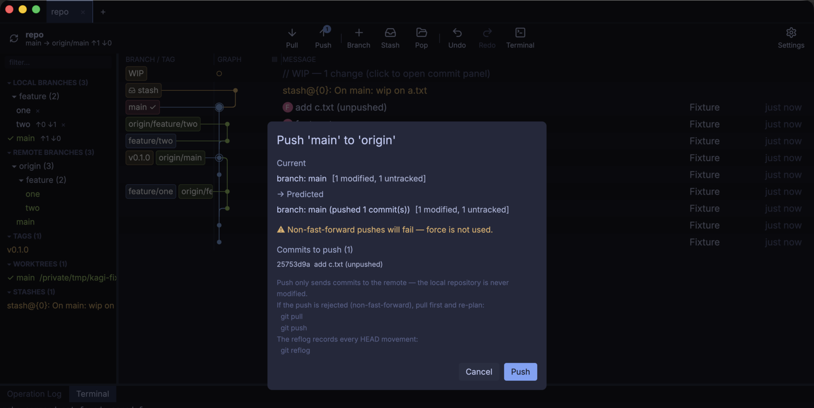
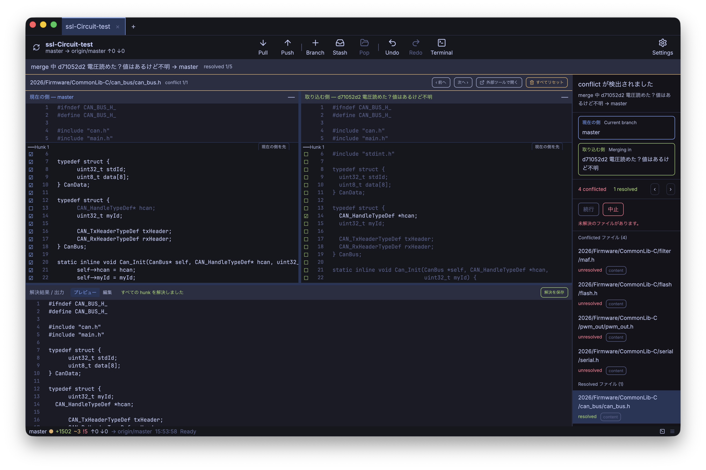
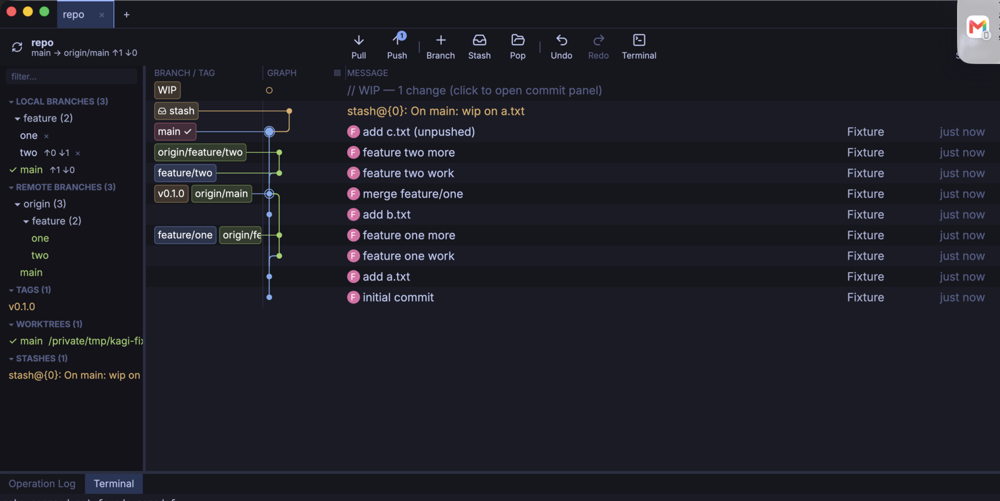
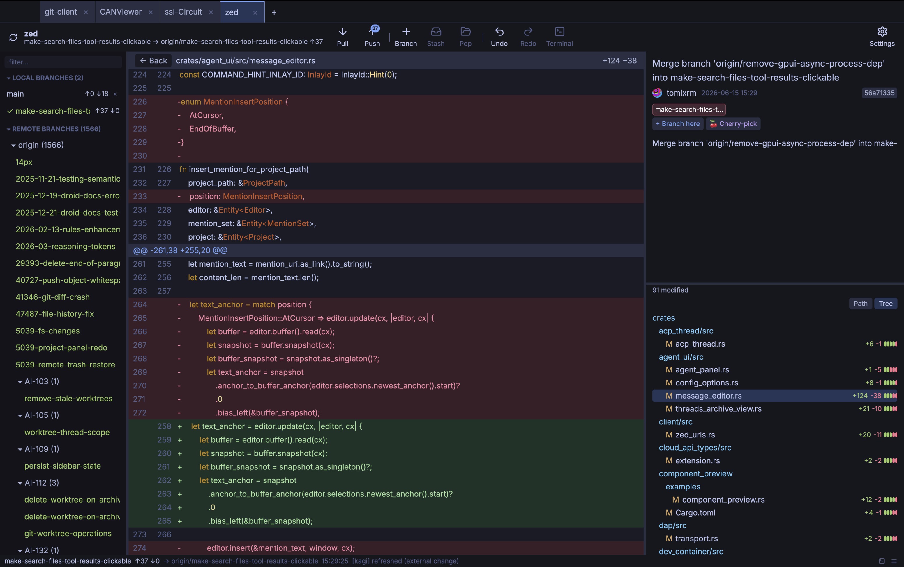

<div align="center">


# Kagi 🔑

### The Git GUI that shows you what will happen — and can't wreck your repo.

[](https://github.com/TomiXRM/kagi/releases)
[](https://github.com/TomiXRM/kagi/stargazers)
[](https://github.com/TomiXRM/kagi/releases)
[](LICENSE)


Built with Rust + [GPUI](https://www.gpui.rs/) — the UI framework behind [Zed](https://zed.dev/).

**[⬇ Download for macOS · Linux · Windows](https://github.com/TomiXRM/kagi/releases/latest)** &nbsp;·&nbsp; [日本語 README](./README.ja.md)


</div>

---

Kagi is a desktop Git client built around one idea: **you should never be surprised by a Git command.** Before anything is written, it shows you the current state, the predicted state, any warnings or blockers, and how to undo it — then runs the operation through a `plan → confirm → preflight → execute → verify` pipeline.

The commands that lose work — `push --force`, `reset --hard`, `git clean` — aren't gated behind a confirmation dialog. **They aren't in the codebase at all.**

> **Status** — actively developed and used daily on macOS. Linux is supported; **Windows is experimental** (CI-built, not yet maintainer-verified). macOS builds are ad-hoc signed (not yet notarized) — first-launch steps are in [Install](#-install).

## Safety is the product

<div align="center">

</div>

Every write opens a **plan** first — current → predicted state, warnings, blockers, and a plain-language recovery recipe. When a blocker is present, there is no execute button to click. This isn't an "are you sure?" dialog bolted on top; it's the only way operations run.

| What Kagi guarantees | How it's enforced |
|---|---|
| **You see the outcome first** | Every operation shows a plan: current → predicted state, warnings, blockers, and a recovery recipe. With a blocker present, the execute button isn't even rendered. |
| **Destructive commands don't exist** | `push --force`, `reset --hard`, and `git clean` are **not implemented anywhere** — enforced by a CI grep gate, not by discipline. |
| **Conflicts are predicted, not discovered** | Cherry-pick / revert / merge / checkout conflicts are found by in-memory `libgit2` dry-runs; your working tree is untouched when a conflict is foreseen. |
| **Conflict resolution is reversible** | Entering Conflict Mode can always be aborted to the exact pre-operation state, and in-progress resolutions autosave. |
| **Nothing is silently lost** | Auto-stash before checkout, an object-DB blob backup before every discard, and an append-only operation log (`~/.kagi/operations.jsonl`) with before/after states. |
| **Refs move last** | The working tree is written first and refs are moved last, so a mid-operation failure leaves HEAD where it was. |

## Resolve conflicts line by line

<div align="center">

</div>

When a merge, rebase, cherry-pick, or revert conflicts, Kagi opens **Conflict Mode**: a three-pane editor — **Current**, a live editable **Result**, and **Incoming** — with accept toggles at file, chunk, and *individual-line* granularity, a conflict dashboard, and a Save → stage → Continue flow.

In the shot above, one branch moved the LED to the board's built-in pin and another sped up the blink — so the LED pin and the `delay()` interval both conflict. You can take the **pin from one branch and the interval from the other**, in the same file, and watch the Result update as you click. Or abort, and you're back exactly where you started.

## A commit graph you can read

<div align="center">

</div>

Colored lanes track each branch's history; ref badges and a HEAD ring mark where you are; merge nodes render inline; a live **WIP row** sits at the top; and **stashes are drawn right in the graph** — each with a line back to the commit it was created on. A label-to-node connector ties every branch and tag to its commit. Virtualized, so it stays smooth on repositories with 10k+ commits (the screenshots are real history — Zed above, a small fixture here).

## Inspect any commit

<div align="center">

</div>

Select a commit to open the inspector: author, co-authors, and full message; a changed-file tree with per-file `+N −M` diffstat bars; and a syntax-highlighted, line-numbered diff with `+`/`−` hunks. Selecting a file jumps straight to its diff.

## And the rest of the daily driver

- **Commit suite** — staging with `+N −M` diffstat bars, a pre-commit checklist (conflict markers / secrets / large binaries), per-branch draft autosave, `type(scope): summary` message templates, and amend with a SHA-change preview.
- **Smart commit messages** — rule-based generation always available; a **local Ollama LLM is strictly opt-in** (staged diff only, localhost only, explicit consent).
- **Async everything** — checkout, commit, stash, pull/push, merge… run off the UI thread with a spinning busy snackbar; the window never freezes.
- **Make yourself at home** — 6 color themes, English / Japanese UI (Git domain words stay English in both), an integrated terminal, repo tabs, a branch-prefix tree sidebar, an operation log, and uniform UI zoom.

## 📦 Install

Grab the latest build from [**GitHub Releases**](https://github.com/TomiXRM/kagi/releases). Each release ships `SHA256SUMS-*.txt` — please verify your download. From v0.3.4 on, Kagi can also check for and install updates from within the app.

| OS | Asset |
|----|-------|
| macOS (Apple Silicon) | `Kagi-<version>-arm64.dmg` |
| Linux (x86_64 / arm64) | `kagi-<version>-<arch>.tar.gz` (binary + `.desktop` + icon), or the AppImage zip `kagi_Linux-AppImage_<arch>.zip` |
| Windows (x86_64) | `kagi-<version>-x86_64-windows.zip` — extract and run `kagi.exe` (self-contained) |

<details>
<summary><b>macOS — first launch on an unsigned build</b></summary>

Kagi is **not yet notarized by Apple** (ad-hoc signature only — no Apple Developer ID yet), so Gatekeeper warns that the developer can't be verified. Either:

1. **Right-click `Kagi.app` → Open → Open** (once; afterwards it opens normally), or
2. Remove the quarantine attribute:
   ```sh
   xattr -dr com.apple.quarantine /Applications/Kagi.app
   ```

Signing + notarization is planned once an Apple Developer Program membership is in place.
</details>

<details>
<summary><b>Linux — AppImage</b></summary>

```sh
unzip kagi_Linux-AppImage_<arch>.zip && bash install_linux_desktop.sh
```
registers it under `~/.local` (icon + `.desktop` entry, fully offline).
</details>

<details>
<summary><b>Windows — first launch & status</b></summary>

The Windows build is **experimental / best-effort** (built and packaged by CI, not yet runtime-verified by the maintainers — please report issues). It is unsigned, so SmartScreen warns on first launch: **More info → Run anyway**. A normal `git` install on `PATH` is recommended (Kagi shells out to `git` and opens an integrated terminal).
</details>

## 🛠️ Build from source

<details>
<summary><b>Requirements & steps</b></summary>

Rust stable (rustup), plus:

- **macOS** — **Xcode Command Line Tools only** (no full Xcode; Kagi uses GPUI's `runtime_shaders`).
- **Linux** — GPUI's native build deps. On Debian/Ubuntu:
  ```sh
  sudo apt-get install -y \
    libxkbcommon-dev libxkbcommon-x11-dev libwayland-dev \
    libx11-dev libxcb1-dev libfontconfig-dev libfreetype-dev \
    libasound2-dev libvulkan-dev libzstd-dev
  ```

```sh
git clone https://github.com/TomiXRM/kagi.git
cd kagi
cargo run --release -- /path/to/your/repo
```

First build takes a few minutes (gpui / libgit2); afterwards it's seconds. Bare repositories are not supported (point it at a normal repo with a working tree).

**Install the `kagi` command** onto your `PATH`:
```sh
cargo install --path .          # installs `kagi` to ~/.cargo/bin
kagi /path/to/your/repo         # open Kagi on that repo
kagi                            # no arg → Welcome screen
```
The binary embeds all its assets, so it's self-contained.

**Try it without touching your repos:**
```sh
REPO=$(bash scripts/make_fixture.sh)   # branches, a merge, a remote, tags, a stash, a dirty tree
cargo run -- "$REPO"
```
</details>

## 🧑‍💻 Development

<details>
<summary><b>Tests, docs & the v1.0 re-architecture</b></summary>

```sh
cargo test --workspace
```

- Design docs: [docs/requirements.md](docs/requirements.md) · [docs/architecture.md](docs/architecture.md) · [ADRs](docs/adr/)
- **Never test against a real repository** — use `scripts/make_fixture.sh` / tempdirs. The `KAGI_*` env vars are headless-testing tools only.
- Kagi is being re-architected into a layered Cargo workspace so the safety-first design is enforced by the type system, not by convention — details in [docs/rearch/](docs/rearch/) and [ADRs 0072+](docs/adr/). The core invariant: the UI never touches `git2` directly — all Git work flows through the `plan → confirm → preflight → execute → verify → log` pipeline (enforced by a CI grep gate).
</details>

## 📄 License

[MIT](LICENSE). The vendored terminal component (`vendor/gpui-terminal`) is upstream-licensed MIT OR Apache-2.0 and is used here under MIT.
