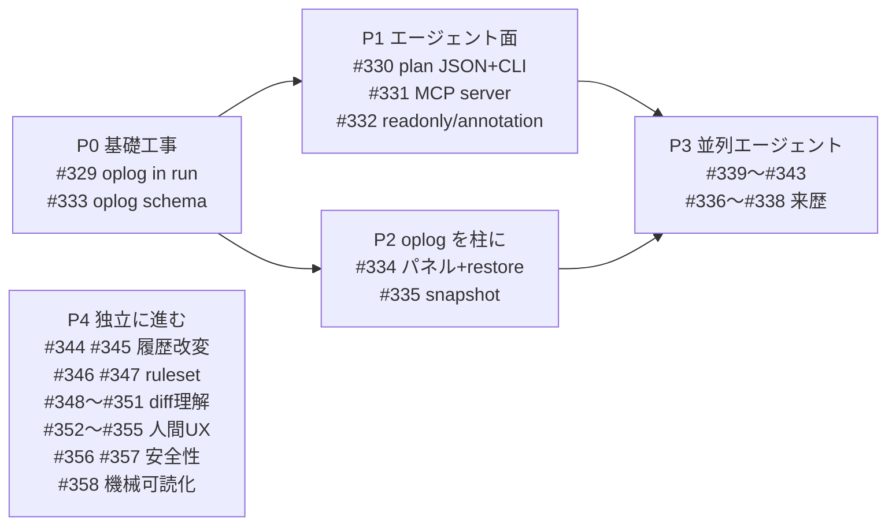

# Kagi を AI native かつ人間に優しいアプリへ — 2026Q3 サーベイ統合とロードマップ

- 調査日: 2026-09-03
- 一次資料: [survey-2026q3-git-gh-features.md](./survey-2026q3-git-gh-features.md) / [survey-2026q3-git-clients.md](./survey-2026q3-git-clients.md) / [survey-2026q3-ai-native-dev.md](./survey-2026q3-ai-native-dev.md) / [survey-2026q3-worktree-managers.md](./survey-2026q3-worktree-managers.md) / [survey-2026q3-human-ux.md](./survey-2026q3-human-ux.md)
- 候補総数: 136 件（5 スライス合算）→ 本ドキュメントで 10 テーマ / 30 Issue に整理

このドキュメントは **調査の統合と方針** であって決定ではない。個別の決定は ADR に、実装単位は Issue と ticket に落ちる。

---

## 0. 結論を 5 行で

1. **Kagi の「破壊的操作が存在しない」という性質は、AI 時代に初めて商品価値に変換できる。** エージェントに git を触らせる経路として `push --force` / `reset --hard` / `git clean` が構造的に存在しないバックエンドは、現存する git MCP server に無い。最優先は **Kagi を MCP server / CLI として公開すること**。
2. ただしその前に直すべき前提が 1 つある。**`Backend::run` は oplog を書かない**（記録は UI の `record_op` にある、ADR-0104 Consequences）。この穴を残したままエージェント面を作ると、エージェント経由の書き込みが oplog に載らず「undo できる」という製品の約束が崩れる。
3. **oplog は Kagi 最大の差別化なのに UI に出ていない。** `OpLogEntry` に ID も親も無く、「N 手前へ restore」「1 操作だけ revert」ができない。スキーマ変更は早いほど安い。
4. **worktree は AI 時代の主戦場になった**（Claude Code が `--worktree` を一級機能化、`.worktreeinclude` が事実上の規格に収束）。Kagi の ADR-0103「全 worktree の WIP を 1 グラフに同時表示」は調査した 24 ツール中どれもやっていない固有の柱。一方で standalone 削除・lock・prune・repair・post-create フックが無いという基本的な穴がある。
5. **エージェント並列実行層の製品寿命は短い**（star 3,113 の Crystal が 1 年足らずで deprecated、vibe-kanban も sunsetting）。Kagi は「実行する側」ではなく **「安全に見て・レビューして・掃除する側」** に立つ方が持続する。

---

## 1. 現状の棚卸し（すでに持っているもの）

新規提案と重複させないための基準線。ADR 149 本 / ticket 267 本から抽出。

### 1.1 安全性（製品の芯）

| 機能 | 根拠 |
|---|---|
| 全書き込みが `plan → confirm → preflight → execute → verify → oplog` を通る | ADR-0104 |
| 破壊的操作の二段確認（armed confirm） | ADR-0023 |
| `push --force` / `reset --hard` / `git clean` がコードベースに存在しない | 実測: `.force()` は `discard.rs` の 1 箇所のみ、`reset.rs` は純粋な ref 移動 |
| force-with-lease push | ADR-0130 |
| discard 時の ODB blob バックアップ | ADR-0046 / ADR-0083 |
| oplog + undo/redo（reflog ベース、`Cmd+Z`） | ADR-0074 / 0081 / 0084 |
| preflight が working-tree digest を比較 | ADR-0147 |
| git CLI の敵対リポジトリ対策 | ADR-0146 |

### 1.2 グラフとビュー

コミットグラフ（ADR-0003 / 0122 stable lanes / 0104 swimlane）、ブランチ solo 表示、squash-merge の ghost connector（ADR-0139）、worktree-aware graph の multi-WIP 行（ADR-0103）、グラフ内 stash 描画（ADR-0088）、split diff view（ADR-0124）、file history（ADR-0089）、Analyze（hotspots / coupling / ownership、ADR-0119）。

### 1.3 コンフリクト

Conflict Mode の一級状態化（ADR-0056）、ResolutionBuffer による repo を汚さない解決（ADR-0057）、bands UI（ADR-0135）、行単位解決（ADR-0071）、continue/abort/skip 安全ポリシー（ADR-0067）、stash-apply/pop の競合解決（ADR-0148）。

### 1.4 GitHub 連携

PR 一覧 / PR merge / review conversation（ADR-0136）、PR conflict preview（ADR-0145）、PR モード（ADR-0137）、tag push（ADR-0140）、merged branch cleanup（ADR-0128）。`gh` CLI 経由。

### 1.5 AI 関連（すでにある）

| 機能 | 状態 |
|---|---|
| Smart Commit（ローカル Ollama / rule-based） | ADR-0044 / 0090、**実装済み** |
| Smart Commit の Claude Code / Codex CLI バックエンド | ADR-0099、**実装済み** |
| Conflict の LLM 補助 | ADR-0061、**設計予約のみ・未実装** |
| `KAGI_*` ヘッドレスハーネス（51 変数） | **テスト専用**。`docs/rearch/inventory.md` が v1.0 で退役予定と明記 |
| MCP server 面 | **無し** |
| `kagi` CLI サブコマンド | **無し**（引数は repo パスのみ） |

### 1.6 基盤

GPUI（ADR-0001）、git2 単一バックエンド（ADR-0002）、crate 分割 + git2 封じ込め（ADR-0072 / 0115）、i18n EN/JA（ADR-0048 / 0129）、Apple HIG テーマ（ADR-0125）、埋め込みターミナル（ADR-0008 / 0035）、埋め込みエディタ（ADR-0132 / 0137）、単一インスタンス（ADR-0102）、SSH リモート（ADR-0089）。

---

## 2. 10 テーマのギャップ分析

### T1. エージェント面 — Kagi を AI が操作できるようにする

**現状**: 無い。`KAGI_*` は 1 プロセス 1 操作でテスト専用、ADR-0077 で mutating hook は撤去済み。

**外部の状況**:
- 既存の `mcp-server-git` の 12 ツールには **worktree / stash / rebase / conflict / oplog / undo が皆無**。Kagi の実装済み機能と穴が正確に重なる。
- Codex は `workspace-write` sandbox でも `<root>/.git` を再帰的に read-only 保護する。エージェントは `.git` を直接書けず、承認済みコマンドか MCP tool 経由になる → **安全な git MCP server が制度的に必要**。
- Codex は「destructive annotation を持つ MCP tool call は必ず承認要求」を実装済み。Kagi の二段確認は MCP annotation に 1:1 写像できる。
- GitButler は `but` CLI + agent skill + MCP を、Aviator は `av` agent plugins を既に出している。

**Kagi の勝ち筋**: 「破壊的操作が構造的に不可能な git MCP server」は空席。ただし前提として oplog の穴（次項）を塞ぐ必要がある。

→ Issue: **#329（前提）**, **#330**, **#331**, **#332**

### T2. oplog を製品の柱にする

**現状**: `OpLogEntry` は `timestamp` / `op` / `repo` / `before` / `outcome` のみ。ID も親も actor も無い。undo は reflog ベースで all-or-nothing。`read_oplog_tail()` はあるが専用ビューが無い。

**構造的な穴**: `Backend::run` は oplog を書かない（ADR-0104 Consequences）。記録は UI 側 `record_op`。エージェント面を作ると約束が崩れる。

**外部の状況**: jj の `op log` / `op restore`（時点復元）/ `op revert`（選択的取り消し）/ `--at-op`、Sapling の `sl undo --keep` / `--preview`、GitButler の `but oplog snapshot -m`、git-branchless の「イベント列 + checkpoint」。Kagi に欠けているのは **時点復元と選択的取り消し**。

**実装方針**: git-branchless の「イベント列 + 定期 checkpoint」なら JSONL 形式を維持できる（content-addressed store は不要）。

→ Issue: **#329**, **#333**, **#334**, **#335**

### T3. エージェント来歴を見せる

**現状**: 無い。コミットの author はエージェント時代には「誰が書いたか」を表さない。

**外部の状況（一次情報で確定した識別子）**:
- Amp: 全コミットに `Amp-Thread-ID:` trailer（値 = スレッド URL）
- Copilot cloud agent: ブランチ接頭辞 `copilot/`、PR author `app/github-copilot`、assignee `copilot-swe-agent[bot]`、trailer `Co-authored-by: Copilot <copilot@github.com>`
- `gh pr/issue list --app` でフィルタ可能
- GitHub ruleset に `require_extra_approval_for_unattributed_changes`（既定 ON）が実在 = **GitHub は「AI が作った変更はレビュー要件が違う」を製品化済み**

**Kagi の勝ち筋**: trailer をパースしてグラフにバッジを出すだけで、他のどの GUI にも無い価値になる。`Amp-Thread-ID` をクリックして会話に飛べる。

→ Issue: **#336**, **#337**, **#338**

### T4. worktree — 並列エージェントの受け皿

**現状（コード実測）**: 作成（ADR-0025 / 0054）、ブランチ削除の副作用としての削除、`unlock` のみ（`lock` が無い）、worktree-aware graph（ADR-0103）。

**穴**:
- standalone の worktree 削除が無い（`WorktreeRecovery::Unlock` が「戻すなら CLI で」と案内 = 機能の穴を自認）
- `lock --reason` が無く unlock と非対称
- `prunable` / `repair` が無い（git worktree で最も復旧が難しい障害に対処できない）
- **post-create / pre-remove フックが無い**（調査した全ツールが持つ唯一の機能で、機能表で Kagi が目立って空白）
- ポート衝突・`.env` 不在という実運用の摩擦への対処が無い

**外部の状況**:
- `.worktreeinclude` は **事実上の規格に収束**（Claude Code / Conductor / VS Code `git.worktreeIncludeFiles` が同一セマンティクス = パターン一致 **かつ** gitignored のみコピー）。読むだけで最大の摩擦が消える。
- ポート衝突は Conductor（`CONDUCTOR_PORT` から 10 ポート予約）と Uzi（`portRange` + `$PORT`）が独立に同じ解に到達。
- gwq v0.1.0 の**セキュリティ修正が最重要の一次情報**: リポジトリ同梱 `.gwq.toml` の `setup_commands` からの任意コード実行。**post-create フックを入れるなら trust prompt は省略不可**。
- wtp の型付きステップ（`copy` / `symlink` / `command`）が Kagi に最適 — plan に何が起きるか正確に列挙でき、`command` だけを trust 対象に切り分けられる。
- Claude Code は v2.1.246 で「自分が作った worktree だけを掃除する」git メタデータマーカー検査を追加。Kagi が一括削除を出すなら同じ事故を先回りで防ぐ必要がある。
- Zed は Kagi と同じ GPUI 製で #53807（どの worktree にいるか分からない）/ #58103（削除が無反応→エラー→実は成功）を抱えている。Kagi は 🌲 + レーン色と plan→confirm→verify で構造的に勝っている。

**やらないこと**: `node_modules` の symlink 共有（依存が乖離した瞬間に壊れる。pnpm `virtualStoreType: global` に案内する）。Kagi 内にコンテナ / VM 実行環境を持つこと（激戦区かつ単一バイナリ配布を壊す）。

→ Issue: **#339**, **#340**, **#341**, **#342**, **#343**

### T5. 履歴改変を安全モデルに載せる

**外部の状況**:
- **`git history`（2.54 experimental, `fixup` は 2.55）** — `drop` / `fixup` / `reword` / `split` を `--dry-run` で「ref 更新プランのみ」出力（`update-ref --stdin` 互換）。**hooks 非実行・中断状態なし・bare 可**。Kagi の `plan → confirm → preflight → execute → verify → oplog` に構造的に 1:1 対応する。
- **`git replay`（2.44+）** — worktree と index に触らないバッチ rebase。`--ref-action=print` で ref 更新を印字。「他 worktree のブランチをそこを checkout せずに rebase」が可能。
- **absorb** — 未コミット hunk を「その行を最後に触った mutable 祖先」へ自動配分。**git-absorb は BSD-3-Clause かつ libgit2 実装**で Kagi の git2 方針と完全整合。
- **interdiff** — ghstack の `automsg` は AI に「前回提出版との差分の差分」を渡す（全 diff ではない）。jj も `interdiff` をコアコマンドに持つ。Kagi の pushed amend + PR review conversation に直結し、トークンと精度を同時に改善できる。

→ Issue: **#344**, **#345**

### T6. リモート契約の事前検証

**外部の状況**: `GET /repos/{o}/{r}/rules/branches/{branch}` は **repo scope のみ・admin 不要**。全 23 ルール型のうち **13 型が完全にローカル検証可能**（`commit_message_pattern` / `commit_author_email_pattern` / `branch_name_pattern` / `max_file_size` / `file_extension_restriction` / `file_path_restriction` / `max_file_path_length` / `required_signatures` / `required_linear_history` / `non_fast_forward` / `creation` / `update` / `deletion`）。1 度取得してキャッシュすれば**往復ゼロで「push が拒否される変更」を commit 前に止められる**。仕様に「ブランチは存在しなくてもよい」とあるのでブランチ作成前の名前検証もできる。

**注意**: classic branch protection が含まれるか断定できなかった。**空レスポンスは「制約なし」ではなく「不明」として扱い、従来の保守的フローを維持する**。

**Kagi の位置づけ**: preflight を「ローカル安全性」から「リモート契約の事前検証」へ拡張する唯一のエンドポイント。

→ Issue: **#346**, **#347**

### T7. 差分と履歴の理解

**現状の穴（grep 実測）**: `remerge` / `range_diff` とも 0 件。generated file 判定なし。word diff / move detection なし。blame が実質無い。

**外部の状況**:
- linguist の `generated.rb` の実判定は移植コスト最小・効果最大（ファイル名リスト、平均行長 > 110 で minified、先頭 40 行の `Code generated` / `DO NOT EDIT`、末尾 2 行の `sourceMappingURL`）。
- `--remerge-diff` は git **2.36**（2022-04）導入。Kagi は in-memory merge（ADR-0005）を持つので **remerge-diff の「機械マージ結果」を自前で計算できる**。マージコミットで「人間が実際に何を判断したか」だけが見える。
- `range-diff` は force-with-lease の二段確認に初めて意味のある情報量を入れられる → **Kagi の存在理由に直結**。
- GitHub の viewed 管理は blob SHA を保存し、変わったら自動で unviewed に戻す。

→ Issue: **#348**, **#349**, **#350**, **#351**

### T8. 人間に優しい基礎

**現状（実測）**:
- `src/ui/commands.rs`（2,047 行）に静的 `COMMANDS` 配列 + `command_state(app,id) -> CommandState` + `effective_keystroke(id)` + `shortcut_listing()` が**既にある** → コマンドパレットはほぼ無料。しかも blocker 理由を出せるので Sublime Merge を超えられる。
- `App::reduce_motion()` / `set_reduce_motion()` が GPUI に存在し `AnimationExt` が自動尊重するが、**OS 設定（`accessibilityDisplayShouldReduceMotion`）は未配線**（zed 全体で 0 件）。
- `Cargo.lock` に `accesskit 0.24.1` / `accesskit_macos` / `accesskit_unix` が gpui 経由で**既在**。GPUI は `.id()` + `.role()` + `on_a11y_action()` を提供。**Kagi 側の `.role(` / `on_a11y_action` / `Role::` 使用は 0 件**。
- `unicode-width 0.2.2` / `unicode-bidi 0.3.18` 依存済み。`cosmic-text` は Han unification 修正の自前フォークを使用中（CJK は解決済み）。
- git の `advice.*` は約 40 項目のカタログ。**Kagi は git2 なので advice が一切出力されない = 人間向け説明は自作必須**。逆に git 20 年分の「詰まる地点リスト」が既製で手に入る。

**やらないこと**: 楽観的 UI（preflight を飛ばすので Kagi では不可）。代わりに **コマンドキュー**（実行中に次を受け付け、`&&` セマンティクス = 前が失敗したら以降を全キャンセル）で体感を改善する。

→ Issue: **#352**, **#353**, **#354**, **#355**

### T9. セキュリティと Git 3.0 互換性

**外部の状況**:
- git 2.55 が sideband のターミナル制御シーケンスを既定無効化、`gh pr diff` も `--allow-escape-sequences` を既定オフに。**Kagi は埋め込みターミナル + リモート由来文字列の表示経路を持つので直撃する**。
- **Trojan Source（CVE-2021-42574）**: 「敵対的エンコーディングは視覚的痕跡を一切生じない」「コンパイラは論理順序に従い視覚順序に従わない」。他 GUI クライアントの対応証拠は見つからず = **安全性優先ブランドに最も筋の通った未実装安全機能**。
- **Git 3.0 の破壊的変更**（確認できた 4 件）: reftable が新規リポジトリ既定（2.51 宣言）→ `.git/refs` 直読みは全滅、`git init` 既定ブランチが `main`（2.52）、symlink symref 消滅（2.52）、Rust が必須・`libgit.a` 単一化（2.52 / 2.55）。
- upstream が実際に直した UX バグ 2 件が Kagi にも当てはまる可能性が高い: 期限切れ GPG 鍵で署名された古いコミットを警告色で出す問題（2.54 修正）、`add -p` で hunk を選択後 split すると分割片が全部 selected になる問題（2.52 修正）。

→ Issue: **#356**, **#357**

### T10. 機械可読化と性能

**外部の状況**: `git repo info -z`（2.52-2.54）で bare/shallow/object.format/references.format/commondir を NUL 区切りで一発取得。`git last-modified -z`（2.52）で file-history の per-file `git log` N 回呼びを 1 回のツリー走査に。`for-each-ref --start-after`（2.51）で ref をサーバ側ページング。`rev-list` の NUL 区切り出力（2.50）。`git url-parse`（2.55）で remote URL パースを本体に委譲。`git maintenance is-needed`（2.53）。

→ Issue: **#358**

---

## 3. ロードマップ（フェーズ）

依存関係のみで並べた。各フェーズ内は並行可能。

| フェーズ | 内容 | 理由 |
|---|---|---|
| **P0** | `Backend::run` に oplog 記録を移す（#329）、oplog スキーマに ID/parent/actor（#333） | どちらもスキーマと責務の変更。**後になるほど高くつく**。エージェント面と時点復元の両方の前提 |
| **P1** | `OperationPlan` の JSON 化 + `kagi` CLI（#330）→ MCP server（#331）→ annotation / readonly（#332） | P0 が済めば一直線 |
| **P2** | oplog パネル + 時点復元（#334）、名前付きスナップショット（#335） | P0 の #333 に依存。UI 側は独立 |
| **P3** | worktree ライフサイクル（#339〜#343）、エージェント来歴（#336〜#338） | #339（`.worktreeinclude`）と #336（trailer パーサ）は依存なしで**今すぐ着手可能** |
| **P4** | 残り全部。相互依存が少ないので人手が空いた順 | #348 / #352 / #353 / #356 / #358 は難易度 S で単独完結 |

**難易度 S で依存なし = すぐ着手できるもの**: #336（trailer パーサ）、#339（`.worktreeinclude`）、#348（generated file 折り畳み）、#352（コマンドパレット）、#356（escape 無害化）、#358 の一部。

---

## 4. Issue 索引

各 Issue は AI に単体で渡して議論できる形式（背景 → 現状 → 提案 → 設計案 → 論点 → 受け入れ条件 → 一次資料）で書かれている。

| Issue | テーマ | タイトル | 難易度 | 依存 |
|---|---|---|---|---|
| #329 | T1/T2 | `Backend::run` に oplog 記録を移す（エージェント面の前提条件） | M | — |
| #330 | T1 | `OperationPlan` の JSON 化 + 安定 ID + `kagi` CLI サブコマンド | M | #329 |
| #331 | T1 | `kagi-mcp` — Kagi を MCP server 化する | L | #330 |
| #332 | T1 | MCP tool annotation の危険度写像 + read-only モード | S | #331 |
| #333 | T2 | oplog スキーマに ID / parent / actor / worktree を追加 | S | — |
| #334 | T2 | oplog パネル + 時点復元（op restore）+ 選択的取り消し（op revert） | L | #333 |
| #335 | T2 | 名前付きスナップショットと `refs/kagi/snapshots/` | M | #333 |
| #336 | T3 | git trailer パーサ + コミット詳細での trailer 表示 | S | — |
| #337 | T3 | エージェント来歴のグラフ / PR 一覧での可視化 | M | #336 |
| #338 | T3 | agent artifacts（AGENTS.md / .claude/**）のファイル分類 | S | — |
| #339 | T4 | `.worktreeinclude` を読んで gitignored ファイルをコピー | S | — |
| #340 | T4 | worktree ライフサイクルの穴埋め（remove / lock / prune / repair） | S | — |
| #341 | T4 | 型付き post-create / pre-remove ステップ + trust prompt | M | #340 |
| #342 | T4 | worktree ごとのポート払い出し + ターミナル紐付け + 環境変数注入 | M | #341 |
| #343 | T4 | 並列エージェントの裁定盤（worktree 横断 diff 比較 → apply / merge） | L | #340 |
| #344 | T5 | `git history` / `git replay` を plan パイプラインに載せる | M | — |
| #345 | T5 | absorb — 未コミット hunk を祖先コミットへ自動配分 | M | — |
| #346 | T6 | GitHub ruleset のローカル検証エンジン | M | — |
| #347 | T6 | PR ライフサイクルの完成（merge queue / mergeStateStatus / CODEOWNERS） | M | — |
| #348 | T7 | generated file / lockfile の自動折り畳み | S | — |
| #349 | T7 | diff 理解の強化（word diff / move detection / remerge-diff / range-diff） | M | — |
| #350 | T7 | blame（blame UI + `.git-blame-ignore-revs` + inline blame） | M | — |
| #351 | T7 | PR review を diff に重畳 + suggested changes 適用 + viewed 管理 | M | — |
| #352 | T8 | コマンドパレット | S | — |
| #353 | T8 | 説明責任 UX（advice カタログ i18n / blocker 文言 / 等価 git コマンド） | M | — |
| #354 | T8 | アクセシビリティ基盤（reduce motion / role / 色覚テーマ） | M | — |
| #355 | T8 | コマンドキューと遅延の説明 | M | — |
| #356 | T9 | セキュリティ（escape 無害化 / bidi・Trojan Source 警告 / 署名 UX） | S | — |
| #357 | T9 | Git 3.0 互換性（reftable / url-parse / hook 制御） | M | — |
| #358 | T10 | 機械可読化と性能（repo info / last-modified / ref ページング / repo health） | M | — |

起票済み。番号は上記リンクの通り。

---

## 5. 取り込まないと判断したもの（横断）

各サーベイの §4 に詳細。統合レベルで確認した却下事項:

| 却下したもの | 理由 |
|---|---|
| Kagi 内にコンテナ / VM 実行環境を持つ | 激戦区。単一バイナリ配布を壊す。worktree 分離で止める |
| checkpoint を git 外スナップショットとして実装 | git クライアントの自己矛盾。`refs/kagi/snapshots/` なら git の作法に留まる（#335） |
| LLM ベースの自動 merge | 間違いを静かに埋め込むリスクが存在理由と衝突。決定論的な mergiraf は検討する |
| `KAGI_*` env harness をエージェント向け公開 API に昇格 | 1 プロセス 1 操作で plan/confirm の 2 段に向かない。ADR-0077 で mutating hook 撤去済み。別途 CLI を作る（#330） |
| oplog を git notes / refs に保存 | push/fetch の話が発生し preflight の前提が複雑化する |
| interactive rebase の TODO 編集 UI | Kagi の「1 操作 = 1 パイプライン」に合わない。単発の履歴編集操作（#344）の方が自然 |
| `node_modules` の symlink 共有 | 依存が乖離した瞬間に壊れる。pnpm `virtualStoreType: global` に案内する |
| 楽観的 UI（実行前に結果を表示） | preflight を飛ばすことになり Kagi では不可。コマンドキュー（#355）で代替 |
| jj の working-copy-as-commit / gix バックエンド | backend 総入れ替えになる。ADR-0032 で既に Reject 済み |
| diff の色非依存化 | **すでに満たされている**（`+`/`-` 記号 + 行番号列）。誤った提案を回避した |

---

## 6. 未解決の疑問（実装前に潰すもの）

サーベイ 5 本の §5 から、実装をブロックし得るものを抜粋。

### エージェント面（#331 の前提）
1. MCP 経路の confirm 承認主体（GUI モーダル / ホスト側 annotation / 両方）と、エージェントがブロックされる体験設計。
2. 同一 worktree への並列 MCP 書き込み時の `preflight_check` / `index.lock` 挙動が**未実測**。
3. `OperationPlan` の JSON 表現を安定 API として公開するか、内部表現のままにするか。

### GitHub 連携（#346 の前提）
4. `GET /rules/branches/{branch}` に classic branch protection が含まれるかを**断定できなかった**。仕様書は「設定レベルに関わらず全 active ルール」とのみ記載。→ **空レスポンスは「制約なし」ではなく「不明」として扱う**方針を採る。
5. エージェント PR の author 判定に使える安定識別子を GitHub API 実物で未確認（`app/copilot-swe-agent` 等）。

### worktree（#341 / #342 の前提）
6. Kagi の vendored `gpui-terminal`（ADR-0035）のプロセスグループ扱いが未調査で、ポート払い出し（#342）の実効性がここに依存する。
7. `docs/performance-review.md:182-186` の既知課題により、worktree ごとの ahead-behind + ディスク使用量収集は ADR-0128 と同じ同期スキャンの罠に入る。**非同期化が前提条件**。
8. `worktree.useRelativePaths` の初出バージョン未確定（2.48 は推測）。

### その他
9. mergiraf の lib crate 化可否と tree-sitter grammar のバイナリサイズ影響が未調査。
10. LM Studio のエンドポイント形状（`/v1/chat/completions` vs `/api/v0/*`）を 2026-09 時点の一次情報で未確認。
11. Git 3.0 の完全な破壊的変更リストが未公開。確認できたのは 4 件のみ。
12. GPUI の `uniform_list`（Kagi で 47 箇所使用）は可視サブセットのみ render するため、スクリーンリーダーに全体が見えない。親に `Role::List` + 行に安定 ID が必要だが、**ループ内 `text!` は ID がソース位置由来なので全要素同一 ID になり release ビルドで黙ってノードが落ちる**という罠がある。
